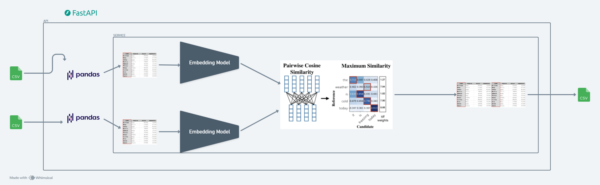

# Fuzzy Matching API


## Table Of Contents
- [Overview](#overview)
- [Setup](#setup)
- [Usage](#usage)
- [Testing](#testing)
- [Additonal Notes](#additional-notes)


## Overview
This project provides an API for merging tables with advanced fuzzy matching, designed to handle variations in data entries (e.g., typos, abbreviations, different languages, etc.). Using FastAPI, this API supports merging two tables based on similar values in specified columns, with options for fuzzy matching and embeddings-based similarity for stronger differences.


## Setup

1. **Clone the Repository**:
```bash
git clone https://github.com/yourusername/fuzzy-matching-api.git
cd my_project
```

2. **Install Dependencies**: Make sure you have Python 3.8+ and install dependencies:

```bash
pip install -r requirements.txt
```
Run the Server: Start the FastAPI server (default is at http://127.0.0.1:8000/):

```bash
uvicorn app.main:app --reload
```

## Usage
### 1. Using curl
To test the ```/merge-tables``` endpoint with curl, use the following command:

```bash
curl -X POST "http://127.0.0.1:8000/merge-tables/" \
-F "file1=@table1.csv" \
-F "file2=@table2.csv" \
-F "key1=column_in_table1" \
-F "key2=column_in_table2" \
-F "threshold=85" \
-F "use_embeddings=true"
```

- ```file1```: Path to the first CSV file.
- ```file2```: Path to the second CSV file.
- ```key1```: Column name in file1 to merge on.
- ```key2```: Column name in file2 to merge on.
- ```threshold```: Similarity threshold for fuzzy matching (default is 80).
- ```use_embeddings```: Set to true to enable embeddings-based matching for stronger text differences.
### 2. Using Python
You can also use the requests library in Python to interact with the API:
```python
import requests

## Define API endpoint
url = "http://127.0.0.1:8000/merge-tables/"

## Define files and data for the request
files = {
    'file1': open('table1.csv', 'rb'),
    'file2': open('table2.csv', 'rb')
}
data = {
    'key1': 'column_in_table1',
    'key2': 'column_in_table2',
    'threshold': 85,
    'use_embeddings': 'true'
}

# Send the request
response = requests.post(url, files=files, data=data)

# Print the response (merged CSV or mapping JSON)
print(response.text)
```

## Testing
Automated tests are included in the ```tests/``` directory. To run the tests, use:

```bash
pytest tests/
```

## Additional Notes
Configuration: You can adjust settings like similarity threshold and embeddings-based matching by modifying the request data.
Extensibility: The API is designed to handle both fuzzy matching and embeddings-based matching. It’s possible to add more custom mappings or additional data processing steps as needed.
